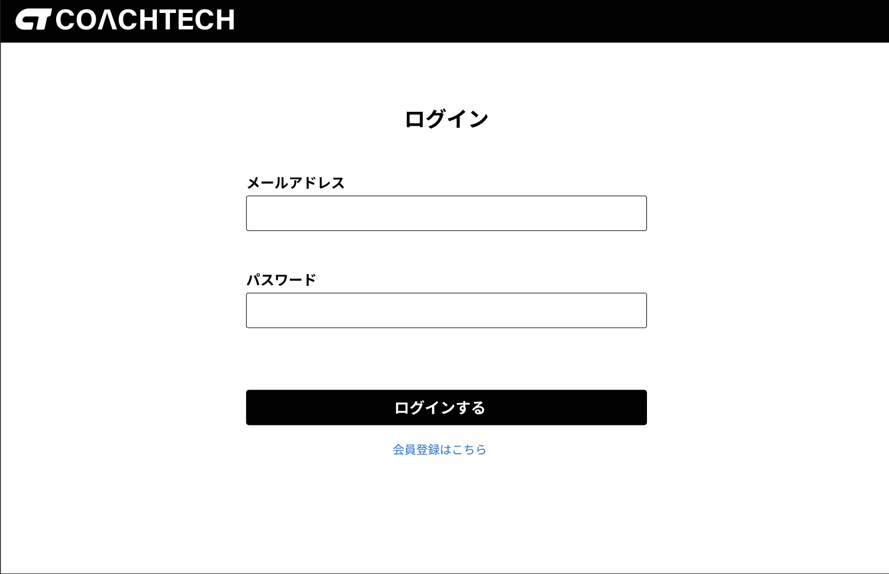
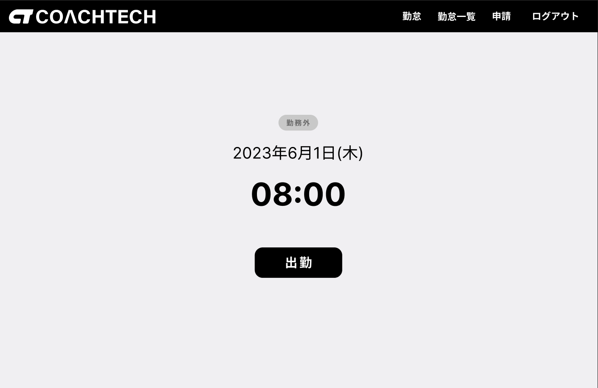
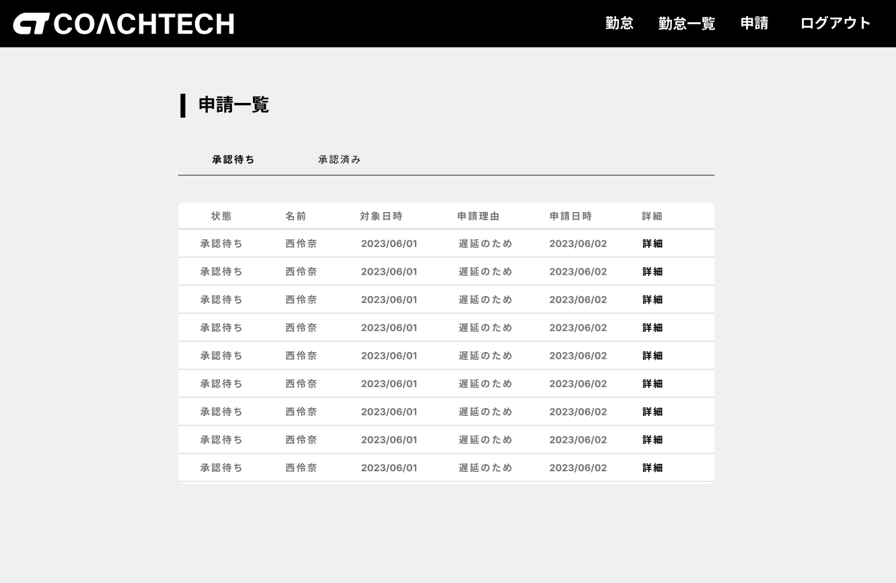
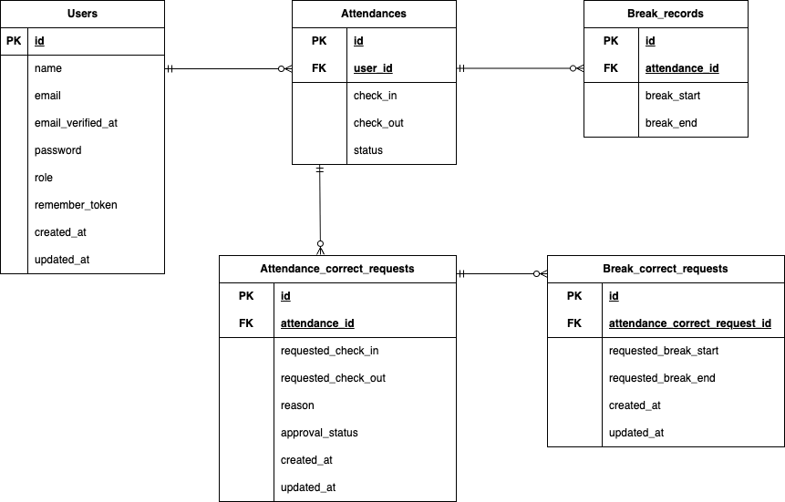

# 勤怠管理アプリ

Laravelで作成した勤怠管理アプリです。
一般ユーザーと管理者で権限を分離し、基本的な機能を備えたシンプルなアプリです。

---

## 概要

Laravelを用いて開発した勤怠管理アプリです。

一般ユーザーは出退勤管理や勤怠修正申請を行うことができ、管理者はスタッフの勤怠管理や修正申請の承認を行うことができます。

認証機能にはLaravel Fortifyを利用し、メール認証による本人確認にも対応しています。

---

## 画面イメージ

### ログイン画面



### 勤怠登録画面



### 修正申請画面



---

## 使用技術

- PHP: 8.4.17
- Laravel: 12.12.2
- DB: MySQL
- MySQL: 8.0
- nginx: 1.28.1
- View: Blade
- Docker / Docker Compose

---

## 機能一覧

### 一般ユーザー

- ユーザー登録
- ログイン
- メール認証
- 勤怠登録（出勤・退勤）
- 休憩開始・終了
- 勤怠一覧表示
- 勤怠詳細表示
- 勤怠修正申請
- 修正申請一覧表示

### 管理者

- ログイン
- 日次勤怠一覧表示
- スタッフ一覧表示
- スタッフ別月次勤怠一覧表示
- CSVエクスポート
- 勤怠修正
- 修正申請一覧表示
- 修正申請承認

---

## ER図

勤怠情報、休憩情報、修正申請情報を管理するため、以下のテーブル構成としています。

### テーブル設計

- users
- attendances
- break_records
- attendance_correct_requests
- break_correct_requests

---



---

## 環境構築

### 1. リポジトリをクローン

```bash
git clone https://github.com/nae6/laravel-attendance-app.git
cd laravel-attendance-app
```

### 2. laravel・Dockerセットアップ

1. Dockerを起動する

2. プロジェクト直下で以下のコマンドを実行する

```bash
make init
```

※このコマンドには.envの作成も含まれていますので、初回時のみ行ってください

### 3. .envの環境変数を設定

基本は `.env.example` を参照してください。
Docker環境用に以下が設定されています：

- DB: MySQL
- Mail: Mailhog

※設定変更後はキャッシュをクリアしてください

```bash
php artisan config:clear
```

---

## テスト

以下は動作確認用のユーザーです。

### 1.管理者

- email: admin@example.com
- password: admin1234

### 2.一般ユーザー

- email: testmomoko@example.com
- password: testmomoko

### 3.ログイン画面

- 一般ユーザー用ログイン画面: http://localhost/login
- 管理者用ログイン画面: http://localhost/admin/login
