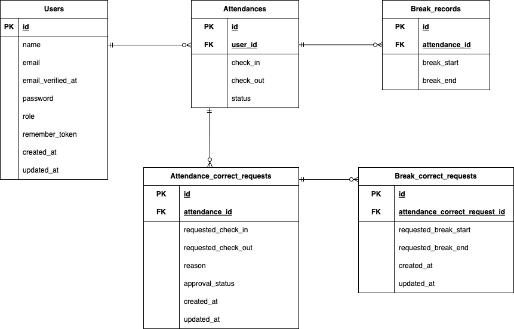

# 勤怠管理アプリ

Laravelで作成した勤怠管理アプリです。
一般ユーザーと管理者で権限を分離し、基本的な機能を備えたシンプルなアプリです。

---

## 概要

Laravelを用いて開発した勤怠管理アプリです。

一般ユーザーは出退勤管理や勤怠修正申請を行うことができ、管理者はスタッフの勤怠管理や修正申請の承認を行うことができます。

認証機能にはLaravel Fortifyを利用し、メール認証による本人確認にも対応しています。

---

## 使用技術

- PHP: 8.4（Dockerイメージ `php:8.4-fpm`）
- Laravel: 12.62.0
- Laravel Fortify: 1.37.2（認証・メール認証）
- DB: MySQL 8.0
- nginx: 1.28.1
- View: Blade
- メール確認: MailHog
- Docker / Docker Compose

---

## 機能一覧

### 一般ユーザー

- ユーザー登録
- ログイン
- メール認証
- 勤怠登録（出勤・退勤）
- 休憩開始・終了
- 勤怠一覧表示
- 勤怠詳細表示
- 勤怠修正申請
- 修正申請一覧表示

### 管理者

- ログイン
- 日次勤怠一覧表示
- スタッフ一覧表示
- スタッフ別月次勤怠一覧表示
- CSVエクスポート
- 勤怠修正
- 修正申請一覧表示
- 修正申請承認

---

## ディレクトリ構成（app配下）

Laravel公式の標準構成に沿って、役割ごとにフォルダを分けています。

| フォルダ | 役割 |
|---|---|
| `Http/Controllers` | リクエストの受付・レスポンス返却のみを担当（1リソース1コントローラー） |
| `Http/Requests` | FormRequestによるバリデーション |
| `Http/Middleware` | 管理者判定などリクエストの通過可否の判定 |
| `Http/Responses` | Fortifyのレスポンス（登録・ログイン・ログアウト・メール認証後の遷移先）のカスタマイズ |
| `Services` | 業務ロジック |
| `Exceptions` | 業務エラーを表す例外 |
| `Policies` | モデルに対する認可 |
| `Enums` | 勤怠ステータス・ユーザーロール・申請ステータス |
| `Models` | Eloquentモデル |
| `Actions/Fortify` | Fortifyのユーザー登録処理 |

画面は `resources/views/components/attendance` に一般ユーザー・管理者で共通のBladeコンポーネント（月次勤怠一覧の表、勤怠修正フォームなど）をまとめています。

---

## ER図

勤怠情報、休憩情報、修正申請情報を管理するため、以下のテーブル構成としています。

### テーブル設計

- users
- attendances
- break_records
- attendance_correct_requests
- break_correct_requests

---



---

## 環境構築

### 1. リポジトリをクローン

```bash
git clone https://github.com/nae6/laravel-attendance-app.git
cd laravel-attendance-app
```

### 2. Dockerビルド

```bash
docker compose up -d --build
```

### 3. Laravel環境構築

#### 1. PHPコンテナに入る

```bash
docker compose exec php bash
```

#### 2. Laravelパッケージのインストール

```bash
composer install
```

#### 3. .env作成

```bash
cp .env.example .env
php artisan key:generate
```

- 必要な環境変数を設定してください

DB_CONNECTION=mysql  
DB_HOST=mysql  
DB_PORT=3306  
DB_DATABASE=attendance_db  
DB_USERNAME=attendance_user  
DB_PASSWORD=attendance_pass  

MAIL_MAILER=smtp  
MAIL_HOST=mailhog  
MAIL_PORT=1025  

- 設定後はキャッシュをクリアしてください

```bash
php artisan config:clear
```

#### 4. データベース初期化

```bash
php artisan migrate
php artisan db:seed
```

---

## テスト

テスト用データベースを作成します。

```bash
docker compose exec mysql mysql -u root -proot -e "CREATE DATABASE IF NOT EXISTS demo_test;"
```

```bash
docker compose exec php bash
php artisan test
```

以下は動作確認用のユーザーです。

### 1.ユーザー

#### 管理者

- email: admin@example.com
- password: admin1234

#### 一般ユーザー（スタッフ）

- email: testmomoko@example.com
- password: testmomoko

### 2.ログイン画面

- 管理者用ログイン画面: <http://localhost/admin/login>
- 一般ユーザー用ログイン画面: <http://localhost/login>

### 3.動作確認方法

事前に以下を実行し、初期データを登録してください。

```bash
php artisan migrate:fresh --seed
```

#### 管理者画面

1. 管理者用ログイン画面にアクセス  
   <http://localhost/admin/login>

2. 以下の管理者アカウントでログイン

   - email: admin@example.com
   - password: admin1234

3. 勤怠一覧画面で以下を確認

   - 当日のスタッフ勤怠一覧が表示される
   - 前日・翌日リンクで日付を切り替えられる
   - 各スタッフの詳細リンクから勤怠詳細画面へ遷移できる

4. 勤怠詳細画面で以下を確認

   - 出勤・退勤時刻、休憩時刻、備考を修正できる
   - 修正後、勤怠一覧画面に戻る

5. スタッフ一覧画面で以下を確認

   - 登録済みスタッフが一覧表示される
   - 詳細リンクからスタッフ別の月次勤怠一覧へ遷移できる

6. 申請一覧画面で以下を確認

   - 一般ユーザーからの修正申請が表示される
   - 詳細画面から申請内容を確認できる
   - 修正申請を承認できる

#### 会員登録・メール認証

1. 会員登録画面にアクセス  
   <http://localhost/register>

2. 名前・メールアドレス・パスワードを入力して登録

3. メール認証誘導画面の「認証はこちらから」からMailHogを開き、届いた認証メールのリンクをクリック  
   <http://localhost:8025>

4. 認証完了後、勤怠登録画面に遷移する

#### スタッフ画面

1. 一般ユーザー用ログイン画面にアクセス  
   <http://localhost/login>

2. 以下の一般ユーザーアカウントでログイン

   - email: testmomoko@example.com
   - password: testmomoko

3. 勤怠登録画面で以下を確認

   - 出勤できる
   - 休憩入できる
   - 休憩戻できる
   - 退勤できる
   - 勤務状態に応じて表示されるボタンが切り替わる

4. 勤怠一覧画面で以下を確認

   - 月ごとの勤怠情報が表示される
   - 前月・翌月リンクで月を切り替えられる
   - 詳細リンクから勤怠詳細画面へ遷移できる

5. 勤怠詳細画面で以下を確認

   - 出勤・退勤時刻、休憩時刻、備考を入力して修正申請できる
   - 申請中の勤怠は承認待ちとして表示される

6. 申請一覧画面で以下を確認

   - 自分が行った修正申請が表示される
   - 承認待ち・承認済みの申請を確認できる
   - 詳細リンクから申請内容を確認できる

---

## 工夫した点

- FormRequestを用いたバリデーションの実装
- バリデーション条件にDBに保存したい値全てを含むことで、バリデーションを通ったデータのみをデータベースに保存できるようにした点（精査されてないデータを含まない仕様）
- transactionを使用した不要なデータが保存されない実装
- 複数処理のある機能にtry-catchを使用し、予期しないエラーを対策
- Controllerはリクエスト受付・画面遷移・レスポンス返却に集中させ、業務ロジックはServiceクラスへ集約（AttendanceActionService／AttendanceService／AttendanceCorrectRequestService／AdminStaffService）。処理の見通しを良くし、今後の仕様変更やテスト追加時にControllerへ複雑な処理が増えすぎないようにした
  - 「出勤記録がない」「承認済みの申請を再承認しようとした」などの業務エラーはServiceから例外（`app/Exceptions`）で通知し、画面に表示するメッセージの組み立てやログ出力はController側で行う
  - Controllerは1リソース1コントローラーとし、メソッド名もリソースコントローラーの規約（index／show／store など）に合わせた
- 勤怠ステータス（勤務外／出勤中／休憩中／退勤済）・ユーザーロール（admin／user）・申請ステータスはEnum（`app/Enums`）で管理し、文字列の直書きをなくした
- 管理者の勤怠修正では、画面から送られる日付ではなく勤怠レコード自身の日付を使って日時を組み立て、hidden inputの改ざんで別の日付に保存されないようにした
- 認証まわりはLaravel Fortifyの仕組みに寄せて実装
  - 登録・ログイン・ログアウト・メール認証後の遷移先は、Fortifyのレスポンスクラス（`app/Http/Responses`）で管理者／一般ユーザーごとに切り替え
  - メール認証のルートはFortify標準のものを使用し、独自定義による重複をなくした
- 一般ユーザーと管理者で共通の画面部品（月次勤怠一覧の表、勤怠修正フォーム、承認待ち表示）はBladeコンポーネントにまとめ、表示の差異や修正漏れが起きにくいようにした
- 権限判定もControllerから分離し、Policy/Gateへ集約
  - 管理者判定のようなモデルに依存しない全体権限はGate（`Gate::define('access-admin', ...)`）
  - 勤怠情報の所有者チェックやスタッフ閲覧可否など特定モデルに対する権限はPolicy（`AttendancePolicy` / `UserPolicy`）

---

## 苦労した点

- Carbonを用いた日時の表示
- 日時データの取り扱い
- テスト用のデータセット作成
- 実行時刻によって結果が変わるテストの対応（深夜に実行すると出勤日が前日扱いになるため、`travelTo()` でテスト内の現在時刻を固定）

## 今後の改善予定

- 勤怠の集計・レポート画面を追加
- 管理者・ユーザーのログイン画面への誘導用トップページを準備する
